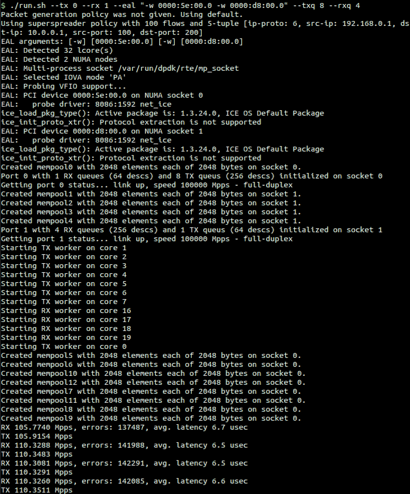

# General Info

Simple packet-gen is a native app for sending raw ethernet packets on a PCI network device using DPDK. It comes with three included packet generator modes, and can be easily extended to support more.



# Prerequisits
1. A DPDK supported NIC (tested with *Intel E810-C*, *Intel X540-AT2*, *Mellanox CX4*)
2. A Linux operating system (tested with Ubuntu 18.04)
3. Sudo permissions
4. Meson and ninja tools for building DPDK (both require Python 3.6 or later)
   ```bash
   sudo apt-get install meson ninja-build
   ```
5. libpcap for supporing PCAP files
   ```bash
   sudo apt-get install libpcap-dev
   ```
# Installation
```bash
# Downloads and builds DPDK 19.11 in ./dpdk/
# Needs sudo permissions (DPDK is installed localy, not system-wide)
./build.sh

# Build with performance optimizations
make

# Optional: build for debug, without performance optimizations
make debug
```

# Running
Use `run.sh` to start the application. Usage examples:
```bash
# Show command line arguments and help
./run.sh --help

# Start client with 8 TX qeueus, 4 RX queues,
# send on PCI 0000:01:00.0, receive on PCI 0000:02:00.0
./run.sh --tx 0 --rx 1 --eal "-w 0000:01:00.0 -w 0000:02:00.0" --txq 8 --rxq 4

# Same as before, use "superspreader" mode with 700 flows, start from 5-tuple
# [TCP, src-ip: 10.0.0.1, dst-ip: 20.0.0.1, src-port: 30, dst-port: 500]
./run.sh --tx 0 --rx 1 --eal "-w 0000:01:00.0 -w 0000:02:00.0" --txq 8 --rxq 4 --p-superspreader --5tuple "6,10.0.0.1,20.0.0.1,30,500" --flows 700

# Same as before, read PCAP file from "./trace.pcap"
./run.sh --tx 0 --rx 1 --eal "-w 0000:01:00.0 -w 0000:02:00.0" --txq 8 --rxq 4 --p-pcap --pcap-file "./trace.pcap"
```

To start GDB, use `run.sh` with GDB as the first argument.

# Contributing
Bug fixes and new generator modes are welcome. To create a new packet generator function, follow the steps in [here](https://github.com/alonrs/simple-dpdk-client/blob/7760dab4bb11c938d7875e7f61a604663575ddb1/lib/generator.h#L35). See existing generator functions in [here](https://github.com/alonrs/simple-dpdk-client/blob/7760dab4bb11c938d7875e7f61a604663575ddb1/lib/generator.c#L34).

# License
MIT license. See LICENSE.MD for more information.

